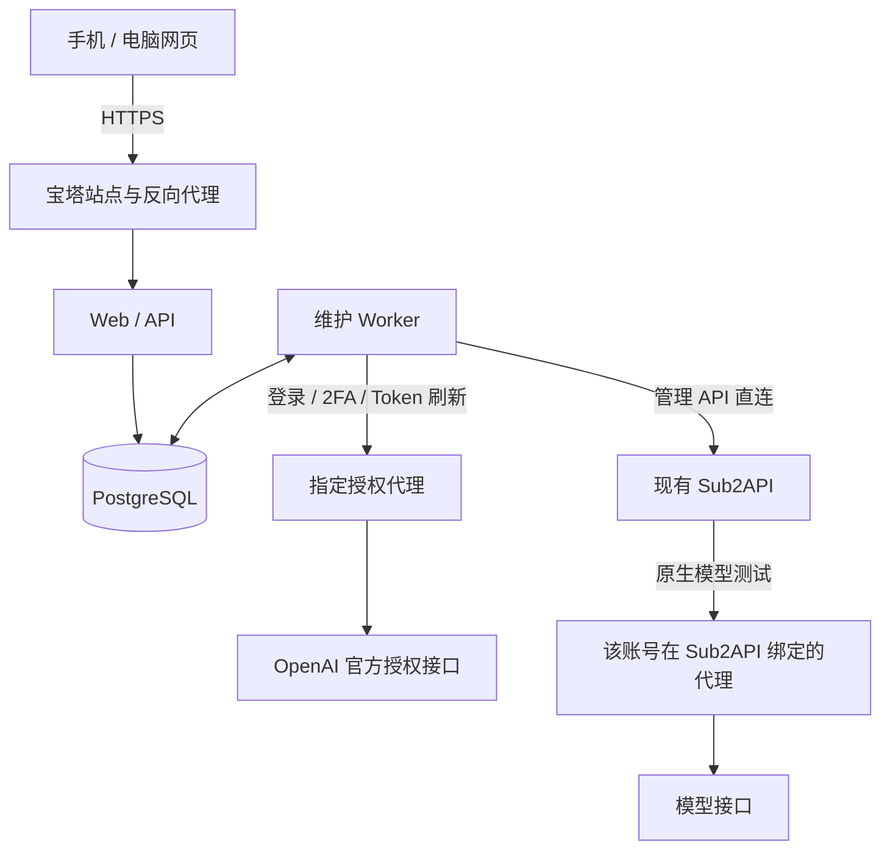

# 香港物理机部署设计

状态：设计稿，2026-09-18。仅完成只读勘察，未部署、未修改服务器配置。

## 1. 实际环境与边界

- SSH 别名：香港物理机；实际主机名：DS3166。连接参数仅从本机 SSH config 解析。
- Debian 12，8 个逻辑 CPU，约 15.6 GiB 内存；本次采样可用约 8.1 GiB。
- 根分区剩余约 178 GiB，使用率 58%。1 分钟负载约 0.30。
- Swap 约 2 GiB，接近占满；短时 vmstat 采样 si/so 为 0，没有观察到持续换页。该采样不能代表高峰，部署要配置独立资源上限并复盘。
- 宝塔面板运行中，存在 Docker 管理数据库。部署前通过面板确认 Docker 编排入口、现有项目与站点，不根据数据库文件存在就认定所有容器均被面板管理。
- 香港机不经代理访问 https://sub.88api.ai/ 返回 HTTP 200，耗时约 1.20 秒。此结果只证明网站连通性，管理员鉴权需在上线验收时验证。
- 遵照用户要求：OpenAI 外部接口必须走代理，未尝试在香港直接登录或刷新真实账号。
- 当前桌面配置没有程序级 http_proxy。不能据此推断香港机已有可用的授权代理；桌面可能使用系统或其他网络出口。
- NTPSynchronized=no；chrony、chronyd、ntp、ntpd、systemd-timesyncd 查询均 inactive。不能直接推断时钟漂移，但上线前必须经宝塔对应系统管理入口核验授时；若面板无法管理，按既定规则另行确认底层方案后执行。

## 2. 推荐架构

一个独立宝塔 Docker 编排项目，三个服务：

| 服务 | 职责 | 初始资源上限建议 |
| --- | --- | --- |
| Web/API | FastAPI，登录会话，账号/配置管理，响应式网页静态资源，日志流，任务提交 | 0.5 CPU / 512 MiB |
| Maintenance worker | 复用 Python 协议授权、curl_cffi、本地 TOTP、原账号恢复逻辑 | 1 CPU / 1 GiB |
| PostgreSQL | 加密账号资料、Token、任务、运行阶段、锁和审计记录 | 0.5 CPU / 512 MiB |

这些是初始限额，不是实测容量保证。授权并发初始为 2，试运行后再调整。先不部署浏览器服务，也不增加 Redis；由 PostgreSQL 承担持久任务队列及领取租约，避免另加一套队列依赖。

电脑和手机共用响应式网页，可添加手机桌面快捷方式。现有 Windows 客户端以后可改为远端客户端，但不再独立刷新或授权同一批账号。维护任务在服务器端运行，浏览器断开不停止任务。

## 3. 三类网络连接必须分开

### 管理入口

手机/电脑通过 HTTPS 域名访问香港机。入口可使用现有 DNS 服务，Cloudflare 若使用只承担 DNS/CDN，不承载维护核心。站点、域名、证书和反向代理全部在宝塔创建和管理。

Web/API 只映射到香港宿主机回环地址，拟用 127.0.0.1:18088，部署时重新确认空闲。数据库和 Worker 不开放公网端口。反向代理日志流配置只作用于该站点，通过宝塔完成。

### OpenAI 授权出口

- 程序显式配置 HTTP CONNECT 或 SOCKS5h 代理，并核对 curl_cffi 与普通 HTTP 客户端的支持；SOCKS 模式由代理解析目标 DNS。
- 第一版直接使用香港机可达的代理地址；不要求安装系统 VPN，不修改整机默认路由。
- 如果用户只有订阅节点而没有可用 HTTP/SOCKS 入口，可增加项目专属代理容器，但需后续选型并由宝塔 Docker 编排管理，仅供内部网络访问。
- 同一账号固定绑定授权代理，同一授权事务从登录、2FA、重定向到换 Token 使用同一会话和同一出口。禁止按请求随机换 IP。
- 默认代理是尚未分配账号的回退配置；已绑定账号保持固定。代理切换仅在任务开始前由明确的策略或人工操作触发，不能在一次登录途中自动切换。
- 代理不可达、认证失败、目标 TLS 失败分别记录。代理故障暂停相关授权任务，不回退香港直连，也不把代理故障记为账号凭据错误；代理连通不等于该账号一定可授权。
- 全部外部授权请求保留 TLS 证书校验。清理 Worker 对环境代理变量的隐式依赖，防止管理请求和授权请求错误串路。

### Sub2API 管理与模型测试

- 管理 API 默认从香港机直连 sub.88api.ai；另设可选管理代理，独立于授权代理。
- 查询、补授权、读回和提交原生测试请求都走管理连接。
- 真正的模型测试由现有 Sub2API 发出，仍使用它所绑定的账号代理。修改香港机授权代理不会改变该代理。
- Sub2API 的 proxy_id 是远端记录 ID，不是本地代理 URL。配置界面分别展示“授权代理”和“Sub2API 代理 ID”，可记录两者对应关系以尽量使用一致出口，但须验证实际连通及出口，不能只凭 ID 认定相同。
- 当前一个 http_proxy 同时用于所有请求的实现需要拆成 auth_proxy、sub2api_admin_proxy 和 account_auth_proxy_binding。

## 4. 维护任务与一致性

默认每 60 秒读取远端账号快照，只处理明确开启监控且唯一匹配的账号。普通限流、临时冷却、主动停用不触发重新登录。

任务状态：

待巡检 → 确认远端 ID/身份/401 → 获取账号任务租约 → 核验代理 → 刷新或协议重新授权 → 校验邮箱/工作区/有效期 → 加密持久化新凭据 → 原账号补授权 → 读回凭据及启用状态 → 等待可调度 → 原生模型测试 → 持续巡检。

- API 只提交任务，Worker 执行；手机、电脑、定时器共用相同队列，同一账号至多一个维护任务。
- 用数据库领取任务、租约心跳和操作版本避免并发执行；不在长时间网络调用期间持有数据库事务锁。
- 新凭据与“待补授权”阶段原子落库。上传失败恢复到补授权阶段，不重复旋转 Refresh Token 或重新登录。
- 网络中断后的授权结果无法确认时记录“结果不确定”，先对账或转人工；不能保证外部 OAuth 副作用 exactly-once，也不能盲目重新提交。
- 补授权通过官方 apply-oauth-credentials 更新原 ID，保持原分组/代理/并发/设备指纹。
- 常规列表/详情隐藏凭据；仅必要的恢复阶段使用官方按单账号 ID 导出接口读取凭据，include_proxies=false，在内存比对，不保存明文导出。无权限时停止恢复，不绕过二次验证。
- 本系统的账号锁不能锁住 Sub2API 自己的刷新任务。写回前读取远端凭据版本，发现外部变化停止覆盖；提交后再次核验，处理不确定结果。
- active、schedulable、限流/临时冷却独立展示。主动停用不自动启用。
- 恢复后的模型测试每份新凭据自动执行一次，发请求前记录已开始；结果丢失显示待复核，不因 Worker 重启重复消费。平时状态轮询不发模型请求。
- 沿用有上限的退避、每账号授权次数限制和人工介入状态；代理故障、账号失败、测试失败分别计数。
- 维持当前可编辑的测试模型与默认列表分组配置，不强制改回出厂值。默认列表分组 ID 2 只控制显示，不限定监控范围。

## 5. 凭据与客户端权限

- 浏览器只取得必要的账号、配额、状态及脱敏日志。登录密码、TOTP 密匙、代理密码和账号 Token 不出现在普通列表、日志及错误报告中。
- 第一版单管理员登录，密码使用适当的密码哈希，支持管理员自己的二次验证。使用安全会话 Cookie、CSRF 校验和登录限速；导入凭据及修改维护策略需登录。
- 账号密文使用带认证的加密方案及独立主密钥。主密钥通过只读 secret 文件挂载，限制文件权限，不放数据库或镜像；数据库备份不包含明文主密钥。运维备份须另行保护并验证密钥恢复流程。
- Windows DPAPI 文件不能直接交给 Linux 解密。由当前 Windows 用户在本机解密后，经已认证 HTTPS 导入服务端重新加密；不生成明文中转文件。也可由用户首次重新导入账号资料。
- 迁移后保留 Windows 原始数据用于回滚，但关闭这批账号的桌面自动维护，避免两个执行端竞争。用户确认试运行通过后再决定历史数据保留策略，不自动删除。

## 6. 宝塔部署与文件安排

- 长期目录建议 /www/wwwroot/openai-token-manager/，由最终宝塔编排记录对应的持久存储挂载；源码和镜像在本地仓库构建、管理版本。
- /www/wwwroot/work 仅作临时中转，不能作为长期项目或数据库目录。
- 网站、域名、SSL、站点反向代理、Docker 编排和重启策略通过宝塔官方入口操作；不改全局 Nginx，不直接写 panel/vhost/nginx。
- 任何实际修改前先说明备份位置：/www/wwwroot/work/backups/openai-token-manager/<时间戳>/，保留原文件相对路径。
- 持久数据包括数据库、加密资料、任务阶段；应用日志轮转并设置保留期限。计划备份通过宝塔计划任务管理，恢复演练需同时验证数据库和加密密钥。
- 应用提供存活、数据库连接和 Worker 心跳检查；代理故障单独呈现，不通过不断重启应用来“修复”代理。
- 时钟同步问题须在生产 2FA 试运行前解决或证明已有可靠授时，遵守宝塔管理约束。

## 7. 交付顺序与验收

1. 本地将桌面逻辑拆成可独立调用的服务层，补充持久化任务、代理分流、资料迁移和手机网页；所有恢复测试使用合成凭据。
2. 通过宝塔部署站点、独立编排、HTTPS；验证香港→Sub2API 管理链路、香港→指定代理→授权目标连通，以及准确授时。
3. 首先只读接入账号、分组、配额、调度和日志。确认与当前 Sub2API 一致，不启用全量恢复。
4. 用户选定试点账号后，迁移该账号资料并停止对应桌面维护；执行一次受控协议授权、原账号补授权及模型测试。不能篡改生产账号制造401。
5. 验证代理断开、进程重启、上传结果不确定、两端重复点击、凭据外部变化等恢复路径。可在本地或测试环境注入故障，生产验收不破坏真实凭据。
6. 试运行观察稳定后再扩展监控范围。最终确认手机关闭页面、电脑关机后任务继续；异常能定位到具体阶段；宝塔可见并可维护全部部署记录。

上线前待确定：管理域名、香港机可用的授权代理入口及备份出口、首批试点账号。此设计不要求现在提供账号密码或2FA密匙。

## 8. 回滚原则

先停止服务端 Worker 并确认没有在途写入，再回退应用版本。若需要回到桌面维护，将服务端最新凭据及任务状态安全同步回桌面后再启用，不能直接启用迁移前的旧 Refresh Token。数据库变更使用可回退迁移；不以旧数据库备份覆盖仍在使用的新授权凭据。
